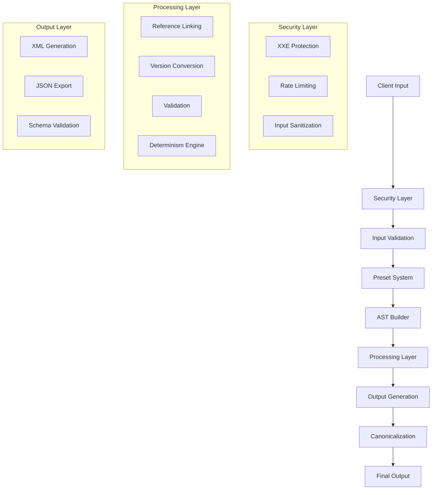
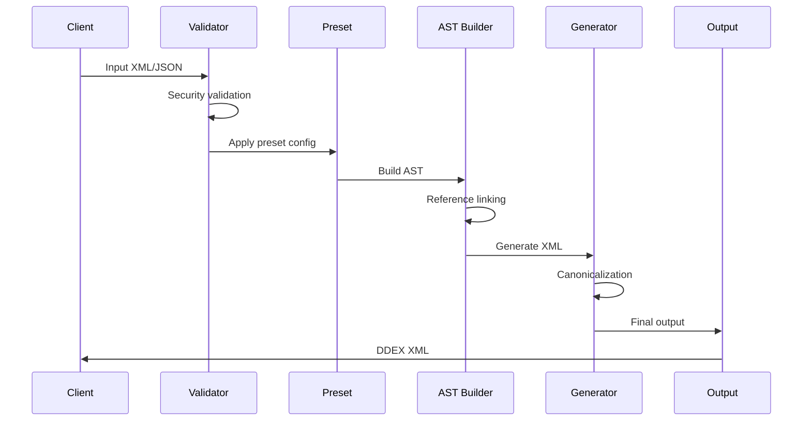

# DDEX Builder Developer Guide

This guide provides in-depth information for developers who want to contribute to DDEX Builder, extend its functionality, or integrate it deeply into their systems.

## Table of Contents

- [Architecture Overview](#architecture-overview)
- [Core Components](#core-components)
- [Development Setup](#development-setup)
- [Contributing Guidelines](#contributing-guidelines)
- [Adding New Presets](#adding-new-presets)
- [Extending the Builder](#extending-the-builder)
- [Performance Optimization](#performance-optimization)
- [Testing Strategy](#testing-strategy)
- [Security Considerations](#security-considerations)
- [Bindings Development](#bindings-development)

## Architecture Overview

DDEX Builder is designed as a modular, high-performance library with clear separation of concerns:



### Design Principles

1. **Security First**: All inputs are validated and sanitized
2. **Deterministic Output**: Same input always produces identical output
3. **Performance**: Sub-millisecond generation for typical use cases
4. **Memory Safety**: Built in Rust with explicit memory management
5. **Extensibility**: Plugin architecture for presets and processors
6. **Type Safety**: Comprehensive type system prevents runtime errors

### Data Flow



## Core Components

### 1. Builder (`src/lib.rs`)

The main entry point providing a high-level API:

```rust
pub struct Builder {
    config: DeterminismConfig,
    presets: IndexMap<String, PartnerPreset>,
    locked_preset: Option<String>,
    version_manager: VersionManager,
    target_version: Option<DdexVersion>,
}
```

**Key Responsibilities:**
- Configuration management
- Preset application
- Version detection and conversion
- Build orchestration

### 2. Security System (`src/security.rs`)

Comprehensive security layer protecting against various attacks:

```rust
pub struct InputValidator {
    config: SecurityConfig,
}

pub struct RateLimiter {
    requests: HashMap<String, Vec<Instant>>,
    config: SecurityConfig,
}

pub struct OutputSanitizer {
    config: SecurityConfig,
}
```

**Security Features:**
- XXE (XML External Entity) attack prevention
- XML bomb detection and prevention
- Path traversal protection
- SQL injection detection
- Rate limiting and DoS protection
- Output sanitization and logging

### 3. AST System (`src/ast.rs`)

Abstract Syntax Tree representation for DDEX documents:

```rust
pub struct AST {
    pub root: Element,
    pub namespaces: IndexMap<String, String>,
    pub schema_location: Option<String>,
}

pub struct Element {
    pub name: String,
    pub namespace: Option<String>,
    pub attributes: IndexMap<String, String>,
    pub children: Vec<Node>,
}
```

### 4. Preset System (`src/presets/`)

Partner-specific configurations and validation rules:

```rust
pub struct PartnerPreset {
    pub name: String,
    pub description: String,
    pub source: PresetSource,
    pub version: String,
    pub determinism: DeterminismConfig,
    pub defaults: PresetDefaults,
}
```

### 5. Version Management (`src/versions/`)

Multi-version DDEX support with automatic conversion:

```rust
pub struct VersionManager {
    supported_versions: Vec<DdexVersion>,
    converters: IndexMap<(DdexVersion, DdexVersion), VersionConverter>,
}
```

### 6. Determinism Engine (`src/determinism.rs`)

Ensures byte-perfect reproducible output:

```rust
pub struct DeterminismConfig {
    pub line_ending: LineEnding,
    pub indent_char: IndentChar,
    pub indent_width: usize,
    pub verify_determinism: Option<usize>,
}
```

## Development Setup

### Prerequisites

```bash
# Rust toolchain
curl --proto '=https' --tlsv1.2 -sSf https://sh.rustup.rs | sh
rustup update stable

# Additional tools
cargo install cargo-watch cargo-audit cargo-deny
rustup component add clippy rustfmt

# For bindings development
cargo install wasm-pack
pip install maturin
npm install -g @napi-rs/cli
```

### Clone and Build

```bash
git clone https://github.com/daddykev/ddex-suite.git
cd ddex-suite/packages/ddex-builder

# Build and test
cargo build
cargo test

# Run with examples
cargo run --example basic_usage
```

### Development Workflow

```bash
# Watch for changes during development
cargo watch -x check -x test -x run

# Format code
cargo fmt

# Lint code
cargo clippy -- -D warnings

# Security audit
cargo audit
cargo deny check

# Generate documentation
cargo doc --open
```

### Project Structure

```
ddex-builder/
├── src/
│   ├── lib.rs              # Main entry point and Builder
│   ├── ast.rs              # Abstract Syntax Tree
│   ├── builder.rs          # Core building logic
│   ├── security.rs         # Security layer
│   ├── determinism.rs      # Determinism engine
│   ├── error.rs            # Error types
│   ├── presets/            # Partner presets
│   │   ├── mod.rs
│   │   ├── spotify.rs
│   │   ├── youtube.rs
│   │   └── ...
│   ├── versions/           # Version management
│   │   ├── mod.rs
│   │   ├── ern_382.rs
│   │   ├── ern_42.rs
│   │   ├── ern_43.rs
│   │   └── converter.rs
│   ├── generator/          # XML generation
│   ├── canonical/          # DB-C14N implementation
│   ├── streaming/          # Streaming support
│   └── bindings/           # Language bindings
│       ├── node/
│       ├── python/
│       └── wasm/
├── examples/               # Usage examples
├── tests/                  # Integration tests
├── benches/               # Benchmarks
├── docs/                  # Documentation
└── fuzz/                  # Fuzzing targets
```

## Contributing Guidelines

### Code Style

We follow Rust standard conventions with additional rules:

```rust
// Use descriptive names
fn build_sound_recording_element(request: &SoundRecordingRequest) -> Result<Element, BuildError>

// Prefer explicit error types
pub enum BuildError {
    InvalidFormat { field: String, message: String },
    Security(String),
    Validation(Vec<ValidationError>),
}

// Document all public APIs
/// Builds a DDEX-compliant XML document from the provided request.
///
/// # Arguments
/// * `request` - The build request containing source data and configuration
///
/// # Returns
/// * `Ok(BuildResult)` - Successfully generated DDEX XML
/// * `Err(BuildError)` - Build failed with detailed error information
pub fn build(&self, request: BuildRequest) -> Result<BuildResult, BuildError>
```

### Testing Requirements

All contributions must include comprehensive tests:

```rust
#[cfg(test)]
mod tests {
    use super::*;
    
    #[test]
    fn test_build_basic_release() {
        let builder = Builder::new();
        let request = create_test_request();
        
        let result = builder.build_internal(&request).unwrap();
        
        assert!(result.xml.contains("<Release>"));
        assert!(result.stats.generation_time_ms < 100);
    }
    
    #[test]
    fn test_deterministic_output() {
        let builder = Builder::new();
        let request = create_test_request();
        
        let result1 = builder.build_internal(&request).unwrap();
        let result2 = builder.build_internal(&request).unwrap();
        
        assert_eq!(result1.xml, result2.xml);
    }
    
    #[test]
    fn test_security_validation() {
        let builder = Builder::new();
        let malicious_request = create_xxe_request();
        
        let result = builder.build_internal(&malicious_request);
        assert!(matches!(result, Err(BuildError::Security(_))));
    }
}
```

### Performance Requirements

- **Build time**: <15ms for typical releases
- **Memory usage**: <50MB for large files
- **Determinism**: 100% reproducible output
- **Security**: Zero known vulnerabilities

### Documentation Standards

1. **API Documentation**: All public functions must have rustdoc comments
2. **Examples**: Include working examples in documentation
3. **Error Cases**: Document all possible error conditions
4. **Performance**: Include performance characteristics where relevant

### Pull Request Process

1. **Fork and Branch**: Create a feature branch from main
2. **Implement**: Write code following our style guidelines
3. **Test**: Ensure all tests pass including new ones
4. **Document**: Update documentation as needed
5. **Security**: Run security checks (`cargo audit`, `cargo deny check`)
6. **Submit**: Create pull request with detailed description

## Adding New Presets

### Preset Structure

Create a new preset by implementing the `PartnerPreset` structure:

```rust
// src/presets/my_platform.rs
use super::*;

pub fn my_platform_audio_43() -> PartnerPreset {
    PartnerPreset {
        name: "my_platform_audio_43".to_string(),
        description: "My Platform audio releases (ERN 4.3)".to_string(),
        source: PresetSource::Partner {
            name: "My Platform".to_string(),
            contact: "dev@myplatform.com".to_string(),
            url: Some("https://developer.myplatform.com/ddex".to_string()),
        },
        version: "1.0.0".to_string(),
        locked: false,
        disclaimer: "Optimized for My Platform's audio distribution requirements".to_string(),
        
        determinism: DeterminismConfig {
            line_ending: LineEnding::Unix,
            indent_char: IndentChar::Space,
            indent_width: 2,
            verify_determinism: Some(3),
            ..Default::default()
        },
        
        defaults: PresetDefaults {
            version: DdexVersion::Ern43,
            profile: MessageProfile::AudioAlbum,
            
            required_fields: vec![
                "SoundRecordingId.ISRC".to_string(),
                "ReferenceTitle.TitleText".to_string(),
                "Duration".to_string(),
                "DisplayArtist.PartyName.FullName".to_string(),
            ],
            
            validation_rules: create_validation_rules(),
            default_values: create_default_values(),
            territory_codes: vec!["Worldwide".to_string()],
            distribution_channels: vec!["DigitalDownload".to_string(), "Streaming".to_string()],
            release_types: vec!["Album".to_string(), "Single".to_string()],
            
            ..Default::default()
        },
    }
}

fn create_validation_rules() -> IndexMap<String, ValidationRule> {
    let mut rules = IndexMap::new();
    
    // ISRC validation
    rules.insert(
        "SoundRecordingId.ISRC".to_string(),
        ValidationRule::Pattern("^[A-Z]{2}[A-Z0-9]{3}[0-9]{7}$".to_string())
    );
    
    // Title validation
    rules.insert(
        "ReferenceTitle.TitleText".to_string(),
        ValidationRule::MinLength(1)
    );
    
    // Duration validation (ISO 8601)
    rules.insert(
        "Duration".to_string(),
        ValidationRule::Pattern("^PT([0-9]+H)?([0-9]+M)?([0-9]+(\\.[0-9]+)?S)?$".to_string())
    );
    
    // Audio quality requirements
    rules.insert(
        "TechnicalSoundRecordingDetails".to_string(),
        ValidationRule::AudioQuality {
            min_bit_depth: 16,
            min_sample_rate: 44100,
        }
    );
    
    rules
}

fn create_default_values() -> IndexMap<String, String> {
    let mut defaults = IndexMap::new();
    
    defaults.insert(
        "MessageHeader.MessageControlType".to_string(),
        "LiveMessage".to_string()
    );
    
    defaults.insert(
        "ResourceList.SoundRecording.SoundRecordingType".to_string(),
        "MusicalWorkSoundRecording".to_string()
    );
    
    defaults
}
```

### Register the Preset

Add to `src/presets/mod.rs`:

```rust
mod my_platform;
pub use my_platform::*;

pub fn all_presets() -> IndexMap<String, PartnerPreset> {
    let mut presets = IndexMap::new();
    
    // Existing presets...
    
    // Add new preset
    let preset = my_platform_audio_43();
    presets.insert(preset.name.clone(), preset);
    
    presets
}
```

### Test the Preset

Create comprehensive tests in `tests/presets/`:

```rust
// tests/presets/test_my_platform.rs
use ddex_builder::*;

#[test]
fn test_my_platform_preset() {
    let mut builder = Builder::new();
    builder.preset("my_platform_audio_43").unwrap();
    
    let request = BuildRequest {
        source_xml: create_valid_my_platform_xml(),
        output_format: OutputFormat::Xml,
        preset: Some("my_platform_audio_43".to_string()),
        validate_schema: true,
    };
    
    let result = builder.build_internal(&request).unwrap();
    
    // Verify My Platform-specific requirements
    assert!(result.xml.contains("MusicalWorkSoundRecording"));
    assert!(result.xml.contains("LiveMessage"));
    
    // Performance check
    assert!(result.stats.generation_time_ms < 20);
}

#[test]
fn test_my_platform_validation() {
    let mut builder = Builder::new();
    builder.preset("my_platform_audio_43").unwrap();
    
    let invalid_request = BuildRequest {
        source_xml: create_invalid_isrc_xml(),
        output_format: OutputFormat::Xml,
        preset: Some("my_platform_audio_43".to_string()),
        validate_schema: true,
    };
    
    let result = builder.build_internal(&invalid_request);
    assert!(result.is_err());
}
```

## Extending the Builder

### Custom Processors

Implement custom processing logic:

```rust
// src/processors/my_processor.rs
use crate::ast::{AST, Element};
use crate::error::BuildError;

pub trait Processor {
    fn process(&self, ast: &mut AST) -> Result<(), BuildError>;
}

pub struct MyCustomProcessor {
    config: MyProcessorConfig,
}

impl Processor for MyCustomProcessor {
    fn process(&self, ast: &mut AST) -> Result<(), BuildError> {
        // Custom processing logic
        self.enhance_metadata(&mut ast.root)?;
        self.add_custom_elements(&mut ast.root)?;
        Ok(())
    }
}

impl MyCustomProcessor {
    fn enhance_metadata(&self, element: &mut Element) -> Result<(), BuildError> {
        // Add custom metadata enhancement
        Ok(())
    }
    
    fn add_custom_elements(&self, element: &mut Element) -> Result<(), BuildError> {
        // Add platform-specific elements
        Ok(())
    }
}
```

### Custom Validators

Implement domain-specific validation:

```rust
// src/validators/my_validator.rs
use crate::error::{BuildError, ValidationError};
use crate::ast::AST;

pub trait Validator {
    fn validate(&self, ast: &AST) -> Result<(), BuildError>;
}

pub struct MyCustomValidator {
    rules: Vec<ValidationRule>,
}

impl Validator for MyCustomValidator {
    fn validate(&self, ast: &AST) -> Result<(), BuildError> {
        let mut errors = Vec::new();
        
        for rule in &self.rules {
            if let Err(error) = self.apply_rule(rule, ast) {
                errors.push(error);
            }
        }
        
        if errors.is_empty() {
            Ok(())
        } else {
            Err(BuildError::Validation(errors))
        }
    }
}
```

### Plugin Architecture

Create loadable plugins:

```rust
// src/plugins/mod.rs
use crate::Builder;

pub trait Plugin {
    fn name(&self) -> &str;
    fn version(&self) -> &str;
    fn apply(&self, builder: &mut Builder) -> Result<(), BuildError>;
}

pub struct PluginManager {
    plugins: Vec<Box<dyn Plugin>>,
}

impl PluginManager {
    pub fn new() -> Self {
        Self {
            plugins: Vec::new(),
        }
    }
    
    pub fn register_plugin(&mut self, plugin: Box<dyn Plugin>) {
        self.plugins.push(plugin);
    }
    
    pub fn apply_plugins(&self, builder: &mut Builder) -> Result<(), BuildError> {
        for plugin in &self.plugins {
            plugin.apply(builder)?;
        }
        Ok(())
    }
}
```

## Performance Optimization

### Profiling

Use integrated profiling tools:

```bash
# CPU profiling
cargo bench --features="profiling"

# Memory profiling  
cargo run --features="dhat-heap" --example memory_profile

# Flamegraph generation
cargo flamegraph --example performance_test
```

### Optimization Strategies

#### 1. Memory Optimization

```rust
use ddex_builder::memory_optimization::MemoryManager;

let memory_manager = MemoryManager::new(
    50 * 1024 * 1024  // 50MB limit
);

// Pre-allocate common structures
memory_manager.pre_allocate_pools();

// Use memory-optimized builder
let builder = memory_manager.optimize_builder(builder);
```

#### 2. Parallel Processing

```rust
use ddex_builder::parallel_processing::ParallelBuilder;
use rayon::prelude::*;

let parallel_builder = ParallelBuilder::new(builder, num_cpus::get());

// Process multiple requests in parallel
let results: Vec<_> = requests
    .par_iter()
    .map(|request| parallel_builder.build_request(request))
    .collect();
```

#### 3. Caching

```rust
use ddex_builder::caching::{CacheManager, CacheConfig};

let cache_config = CacheConfig {
    max_entries: 1000,
    ttl_seconds: 3600,
    enable_compression: true,
};

let cache_manager = CacheManager::new(cache_config);
let cached_builder = cache_manager.wrap_builder(builder);
```

#### 4. String Optimization

```rust
use ddex_builder::optimized_strings::StringManager;

let string_manager = StringManager::new();

// Intern frequently used strings
let isrc_key = string_manager.intern("ISRC");
let title_key = string_manager.intern("Title");
```

### Performance Targets

| Metric | Target | Measurement |
|--------|--------|-------------|
| Build Time (10KB) | <5ms | `cargo bench small_release` |
| Build Time (100KB) | <10ms | `cargo bench medium_release` |
| Build Time (1MB) | <50ms | `cargo bench large_release` |
| Memory Usage | <50MB | `cargo run --features=dhat-heap` |
| Determinism | 100% | `cargo test determinism` |
| Throughput | >100 req/s | `cargo bench concurrent` |

## Testing Strategy

### Test Categories

#### 1. Unit Tests

```rust
// Test individual components
#[cfg(test)]
mod tests {
    use super::*;
    
    #[test]
    fn test_element_creation() {
        let element = Element::new("SoundRecording")
            .with_attr("ReleaseId", "R123")
            .with_text("Test content");
            
        assert_eq!(element.name, "SoundRecording");
        assert_eq!(element.attributes.get("ReleaseId"), Some(&"R123".to_string()));
    }
}
```

#### 2. Integration Tests

```rust
// Test complete workflows
#[test]
fn test_end_to_end_build() {
    let mut builder = Builder::new();
    builder.preset("spotify_audio_43").unwrap();
    
    let request = create_complete_release_request();
    let result = builder.build_internal(&request).unwrap();
    
    // Validate complete DDEX structure
    validate_ddex_compliance(&result.xml);
    validate_spotify_requirements(&result.xml);
}
```

#### 3. Property-Based Tests

```rust
use proptest::prelude::*;

proptest! {
    #[test]
    fn test_deterministic_output(
        title in "\\PC{1,100}",
        artist in "\\PC{1,100}",
        isrc in "[A-Z]{2}[A-Z0-9]{3}[0-9]{7}"
    ) {
        let builder = Builder::new();
        let request = create_request_with_data(&title, &artist, &isrc);
        
        let result1 = builder.build_internal(&request).unwrap();
        let result2 = builder.build_internal(&request).unwrap();
        
        prop_assert_eq!(result1.xml, result2.xml);
    }
}
```

#### 4. Security Tests

```rust
#[test]
fn test_xxe_protection() {
    let builder = Builder::new();
    let xxe_request = BuildRequest {
        source_xml: r#"
            <!DOCTYPE test [<!ENTITY xxe SYSTEM "file:///etc/passwd">]>
            <SoundRecording>&xxe;</SoundRecording>
        "#.to_string(),
        // ... other fields
    };
    
    let result = builder.build_internal(&xxe_request);
    assert!(matches!(result, Err(BuildError::Security(_))));
}
```

#### 5. Performance Tests

```rust
use criterion::{criterion_group, criterion_main, Criterion};

fn benchmark_build_performance(c: &mut Criterion) {
    let builder = Builder::new();
    let request = create_benchmark_request();
    
    c.bench_function("build_medium_release", |b| {
        b.iter(|| builder.build_internal(&request))
    });
}

criterion_group!(benches, benchmark_build_performance);
criterion_main!(benches);
```

### Test Data Management

```rust
// tests/test_data/mod.rs
pub struct TestDataBuilder {
    releases: Vec<ReleaseRequest>,
    tracks: Vec<TrackRequest>,
}

impl TestDataBuilder {
    pub fn spotify_audio_release() -> ReleaseRequest {
        ReleaseRequest {
            release_id: "R123456789".to_string(),
            title: vec![LocalizedStringRequest {
                text: "Test Album".to_string(),
                language_code: Some("en".to_string()),
            }],
            artist: "Test Artist".to_string(),
            tracks: vec![self.spotify_audio_track()],
            // ... other fields
        }
    }
    
    pub fn spotify_audio_track() -> TrackRequest {
        TrackRequest {
            isrc: "USRC17607839".to_string(),
            title: "Test Track".to_string(),
            duration: "PT3M45S".to_string(),
            artist: "Test Artist".to_string(),
            // ... other fields
        }
    }
}
```

## Security Considerations

### Input Validation

All inputs must be validated at multiple layers:

```rust
// Layer 1: Type-level validation
pub struct ValidatedISRC(String);

impl ValidatedISRC {
    pub fn new(isrc: &str) -> Result<Self, BuildError> {
        if Self::is_valid_format(isrc) {
            Ok(ValidatedISRC(isrc.to_string()))
        } else {
            Err(BuildError::InvalidFormat {
                field: "ISRC".to_string(),
                message: "Invalid ISRC format".to_string(),
            })
        }
    }
    
    fn is_valid_format(isrc: &str) -> bool {
        isrc.len() == 12 && 
        isrc.chars().take(2).all(|c| c.is_ascii_uppercase()) &&
        isrc.chars().skip(2).take(3).all(|c| c.is_ascii_alphanumeric()) &&
        isrc.chars().skip(5).all(|c| c.is_ascii_digit())
    }
}

// Layer 2: Content validation
impl InputValidator {
    pub fn validate_content_safety(&self, content: &str) -> Result<(), BuildError> {
        // Check for dangerous patterns
        if self.contains_script_injection(content) {
            return Err(BuildError::Security("Script injection detected".to_string()));
        }
        
        // Check for XXE attempts
        if self.contains_external_entities(content) {
            return Err(BuildError::Security("External entity reference detected".to_string()));
        }
        
        Ok(())
    }
}
```

### Output Sanitization

Ensure all output is safe for consumption:

```rust
impl OutputSanitizer {
    pub fn sanitize_for_web(&self, xml: &str) -> Result<String, BuildError> {
        // Remove potentially dangerous elements
        let cleaned = self.remove_script_elements(xml)?;
        
        // Escape all user content
        let escaped = self.escape_user_content(&cleaned)?;
        
        // Validate final structure
        self.validate_xml_structure(&escaped)?;
        
        Ok(escaped)
    }
}
```

### Cryptographic Operations

Use secure cryptographic primitives:

```rust
use sha2::{Sha256, Digest};
use blake3;

impl StableHashGenerator {
    pub fn generate_secure_id(&self, content: &str) -> String {
        match self.algorithm {
            HashAlgorithm::Sha256 => {
                let mut hasher = Sha256::new();
                hasher.update(self.seed.as_bytes());
                hasher.update(content.as_bytes());
                format!("{:x}", hasher.finalize())[..16].to_string()
            }
            HashAlgorithm::Blake3 => {
                let mut hasher = blake3::Hasher::new();
                hasher.update(self.seed.as_bytes());
                hasher.update(content.as_bytes());
                hasher.finalize().to_hex()[..16].to_string()
            }
        }
    }
}
```

## Bindings Development

### Node.js Bindings

Using napi-rs for high-performance Node.js integration:

```rust
// bindings/node/src/lib.rs
use napi::bindgen_prelude::*;
use ddex_builder::{Builder as RustBuilder, BuildRequest, OutputFormat};

#[napi]
pub struct DDEXBuilder {
    inner: RustBuilder,
}

#[napi]
impl DDEXBuilder {
    #[napi(constructor)]
    pub fn new() -> Result<Self> {
        Ok(Self {
            inner: RustBuilder::new(),
        })
    }
    
    #[napi]
    pub async fn apply_preset(&mut self, preset_name: String) -> Result<()> {
        self.inner.preset(&preset_name)
            .map_err(|e| Error::from_reason(e.to_string()))?;
        Ok(())
    }
    
    #[napi]
    pub async fn build(&self, request: JsBuildRequest) -> Result<JsBuildResult> {
        let rust_request = BuildRequest {
            source_xml: request.source_xml,
            output_format: OutputFormat::Xml,
            preset: request.preset,
            validate_schema: request.validate_schema.unwrap_or(true),
        };
        
        let result = self.inner.build_internal(&rust_request)
            .map_err(|e| Error::from_reason(e.to_string()))?;
            
        Ok(JsBuildResult {
            xml: result.xml,
            stats: JsBuildStats {
                generation_time_ms: result.stats.generation_time_ms,
                xml_size_bytes: result.stats.xml_size_bytes,
                releases: result.stats.releases,
                tracks: result.stats.tracks,
                deals: result.stats.deals,
            },
        })
    }
}

#[napi(object)]
pub struct JsBuildRequest {
    pub source_xml: String,
    pub preset: Option<String>,
    pub validate_schema: Option<bool>,
}

#[napi(object)]
pub struct JsBuildResult {
    pub xml: String,
    pub stats: JsBuildStats,
}

#[napi(object)]
pub struct JsBuildStats {
    pub generation_time_ms: u64,
    pub xml_size_bytes: usize,
    pub releases: usize,
    pub tracks: usize,
    pub deals: usize,
}
```

### Python Bindings

Using PyO3 for Python integration:

```rust
// bindings/python/src/lib.rs
use pyo3::prelude::*;
use ddex_builder::{Builder as RustBuilder, BuildRequest, OutputFormat, BuildError};

#[pyclass]
pub struct Builder {
    inner: RustBuilder,
}

#[pymethods]
impl Builder {
    #[new]
    fn new() -> Self {
        Self {
            inner: RustBuilder::new(),
        }
    }
    
    fn preset(&mut self, preset_name: &str) -> PyResult<()> {
        self.inner.preset(preset_name)
            .map_err(|e| PyErr::new::<pyo3::exceptions::PyRuntimeError, _>(e.to_string()))?;
        Ok(())
    }
    
    fn build_internal(&self, request: PyBuildRequest) -> PyResult<PyBuildResult> {
        let rust_request = BuildRequest {
            source_xml: request.source_xml,
            output_format: OutputFormat::Xml,
            preset: request.preset,
            validate_schema: request.validate_schema.unwrap_or(true),
        };
        
        let result = self.inner.build_internal(&rust_request)
            .map_err(|e| PyErr::new::<pyo3::exceptions::PyRuntimeError, _>(e.to_string()))?;
            
        Ok(PyBuildResult {
            xml: result.xml,
            generation_time_ms: result.stats.generation_time_ms,
            xml_size_bytes: result.stats.xml_size_bytes,
        })
    }
}

#[pyclass]
#[derive(Clone)]
pub struct PyBuildRequest {
    #[pyo3(get, set)]
    pub source_xml: String,
    #[pyo3(get, set)]
    pub preset: Option<String>,
    #[pyo3(get, set)]
    pub validate_schema: Option<bool>,
}

#[pyclass]
pub struct PyBuildResult {
    #[pyo3(get)]
    pub xml: String,
    #[pyo3(get)]
    pub generation_time_ms: u64,
    #[pyo3(get)]
    pub xml_size_bytes: usize,
}

#[pymodule]
fn ddex_builder(_py: Python, m: &PyModule) -> PyResult<()> {
    m.add_class::<Builder>()?;
    m.add_class::<PyBuildRequest>()?;
    m.add_class::<PyBuildResult>()?;
    Ok(())
}
```

### WebAssembly Bindings

Using wasm-bindgen for browser integration:

```rust
// bindings/wasm/src/lib.rs
use wasm_bindgen::prelude::*;
use ddex_builder::{Builder as RustBuilder, BuildRequest, OutputFormat};

#[wasm_bindgen]
pub struct DDEXBuilder {
    inner: RustBuilder,
}

#[wasm_bindgen]
impl DDEXBuilder {
    #[wasm_bindgen(constructor)]
    pub fn new() -> Self {
        console_error_panic_hook::set_once();
        
        Self {
            inner: RustBuilder::new(),
        }
    }
    
    #[wasm_bindgen(js_name = applyPreset)]
    pub fn apply_preset(&mut self, preset_name: &str) -> Result<(), JsValue> {
        self.inner.preset(preset_name)
            .map_err(|e| JsValue::from_str(&e.to_string()))?;
        Ok(())
    }
    
    #[wasm_bindgen]
    pub fn build(&self, source_xml: &str, preset: Option<String>) -> Result<WasmBuildResult, JsValue> {
        let request = BuildRequest {
            source_xml: source_xml.to_string(),
            output_format: OutputFormat::Xml,
            preset,
            validate_schema: true,
        };
        
        let result = self.inner.build_internal(&request)
            .map_err(|e| JsValue::from_str(&e.to_string()))?;
            
        Ok(WasmBuildResult {
            xml: result.xml,
            generation_time_ms: result.stats.generation_time_ms,
            xml_size_bytes: result.stats.xml_size_bytes,
        })
    }
}

#[wasm_bindgen]
pub struct WasmBuildResult {
    #[wasm_bindgen(getter)]
    pub xml: String,
    #[wasm_bindgen(getter, js_name = generationTimeMs)]
    pub generation_time_ms: u64,
    #[wasm_bindgen(getter, js_name = xmlSizeBytes)]
    pub xml_size_bytes: usize,
}
```

---

## Next Steps

- 🚀 Start contributing by picking up a [Good First Issue](https://github.com/daddykev/ddex-suite/labels/good%20first%20issue)
- 📖 Read the [User Guide](user-guide.md) for usage examples
- 🔧 Check out the [API Documentation](https://docs.rs/ddex-builder) for detailed reference
- 💬 Join our [Discord Community](https://discord.gg/ddex-builder) for discussions
- 🐛 Report issues on [GitHub](https://github.com/daddykev/ddex-suite/issues)

Questions? Reach out to the maintainers or open a discussion on GitHub!