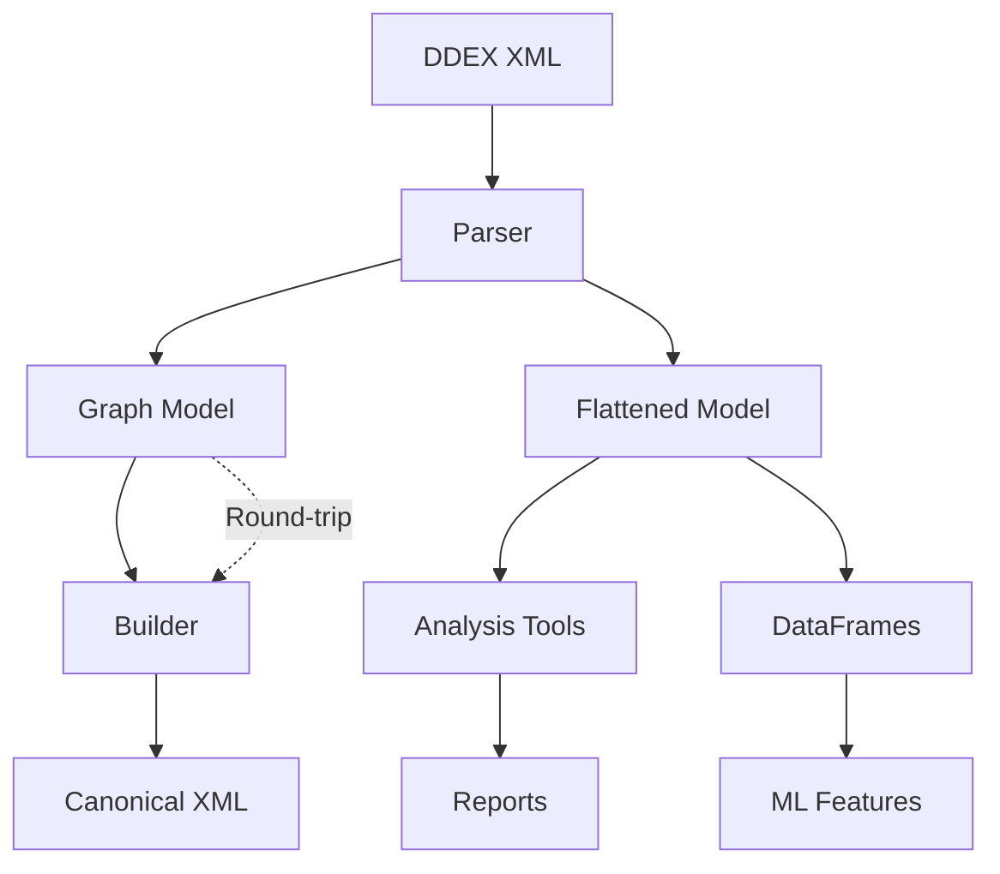

# DDEX Data Models

Comprehensive documentation of DDEX data structures, from graph representations to flattened models across all supported versions.

## Overview

The DDEX Suite provides two complementary data representations:

- **Graph Models**: Faithful to the original DDEX XML structure, preserving hierarchy and relationships
- **Flattened Models**: Developer-friendly denormalized structures optimized for analysis and processing

Both models support round-trip fidelity, ensuring that parsed data can be rebuilt into identical XML.

## Model Categories

### Core Components

- [**Message Models**](./message) - Top-level message structure and headers
- [**Release Models**](./release) - Release and album information
- [**Resource Models**](./resource) - Sound recordings, videos, and other resources  
- [**Deal Models**](./deal) - Commercial terms and licensing information
- [**Party Models**](./party) - Artists, labels, and other parties

### Supporting Types

- [**Identifier Types**](./identifiers) - ISRCs, UPCs, and other standard identifiers
- [**Territory Types**](./territories) - Geographic and territory specifications
- [**Date/Time Types**](./datetime) - Temporal data structures
- [**Technical Types**](./technical) - Audio/video technical specifications

## Version Support

| DDEX Version | Status | Coverage | Notes |
|--------------|--------|----------|-------|
| ERN 3.8.2 | ✅ Full | 100% | Legacy support |
| ERN 4.2 | ✅ Full | 100% | Enhanced metadata |
| ERN 4.3 | ✅ Full | 100% | Latest streaming features |

## Model Comparison

### Graph vs Flattened

| Aspect | Graph Model | Flattened Model |
|--------|-------------|------------------|
| **Fidelity** | 100% XML faithful | Lossy but practical |
| **Complexity** | High (nested) | Low (tabular) |
| **Use Case** | Round-trip processing | Analysis & reporting |
| **Performance** | Memory intensive | Processing optimized |
| **Relationships** | Preserved | Denormalized |

### Example Comparison

#### Graph Model Structure
```typescript
{
  MessageHeader: {
    MessageId: "MSG_001",
    MessageSender: {
      PartyId: "LABEL_001",
      PartyName: {
        FullName: "Record Label Inc"
      }
    }
  },
  ReleaseList: [{
    ReleaseId: "REL_001",
    ReleaseDetailsByTerritory: [{
      TerritoryCode: ["Worldwide"],
      Title: [{ TitleText: "Album Title" }],
      DisplayArtist: [{
        PartyName: [{ FullName: "Artist Name" }]
      }]
    }]
  }]
}
```

#### Flattened Model Structure
```typescript
{
  messageInfo: {
    messageId: "MSG_001",
    sender: "Record Label Inc"
  },
  releases: [{
    releaseId: "REL_001",
    title: "Album Title",
    displayArtist: "Artist Name",
    territory: "Worldwide"
  }]
}
```

## Data Flow



## Model Navigation

### By Use Case

- **XML Processing**: Start with [Message Models](./message)
- **Catalog Analysis**: Focus on [Release Models](./release) and [Resource Models](./resource)
- **Commercial Terms**: Review [Deal Models](./deal)
- **Technical Specs**: Check [Technical Types](./technical)
- **Geographic Rights**: Explore [Territory Types](./territories)

### By Data Type

- **Strings**: Most text fields with length constraints
- **Identifiers**: Structured IDs with validation rules
- **Dates**: ISO 8601 formats with partial date support
- **Durations**: ISO 8601 durations (PT3M45S format)
- **Numbers**: Integers and decimals with precision rules
- **Enums**: Controlled vocabularies from DDEX specifications

## Common Patterns

### Identifier Patterns
```typescript
// Standard identifier with optional proprietary alternatives
interface StandardId {
  value: string;           // e.g., "USRC17607839"
  namespace?: string;      // Optional namespace
}

// Proprietary identifier
interface ProprietaryId {
  namespace: string;       // Required namespace
  value: string;          // Value within namespace
}

type AnyId = string | StandardId | ProprietaryId;
```

### Territory Patterns
```typescript
// Territory specification with inclusions/exclusions
interface TerritoryScope {
  includedTerritories?: string[];
  excludedTerritories?: string[];
}

// Common territory values
type Territory = 'Worldwide' | 'US' | 'GB' | 'DE' | /* ISO codes */;
```

### Date Patterns
```typescript
// Flexible date representation
interface FlexibleDate {
  date?: string;           // YYYY-MM-DD
  approximateDate?: string; // YYYY or YYYY-MM
  isKnown: boolean;
}
```

## Validation Rules

### Common Constraints

| Field Type | Validation | Example |
|------------|------------|---------|
| ISRC | Pattern: `^[A-Z]{2}[A-Z0-9]{3}\d{7}$` | `USRC17607839` |
| UPC | Pattern: `^\d{12}$` or `^\d{13}$` | `123456789012` |
| Duration | Pattern: `^PT(\d+H)?(\d+M)?(\d+(\.\d+)?S)?$` | `PT3M45S` |
| Date | Pattern: `^\d{4}-\d{2}-\d{2}$` | `2024-01-15` |
| Territory | Enum: ISO 3166-1 codes + special values | `US`, `Worldwide` |

### Business Rules

- **Reference Integrity**: All resource references must resolve
- **Territory Consistency**: Deal territories must align with release territories
- **Date Logic**: Release dates must be chronologically consistent
- **Commercial Logic**: Deal terms must be commercially viable

## Performance Considerations

### Memory Usage

| Model Type | Memory Factor | Typical Overhead |
|------------|---------------|------------------|
| Graph | 3-5x XML size | High object nesting |
| Flattened | 1-2x XML size | Denormalized structure |
| DataFrame | 0.5-1x XML size | Columnar storage |

### Processing Speed

| Operation | Graph Model | Flattened Model |
|-----------|-------------|------------------|
| Parse | Slower | Faster |
| Navigate | Complex | Simple |
| Transform | Flexible | Limited |
| Serialize | Direct | Requires mapping |

## Extension Support

### Custom Extensions

The DDEX Suite preserves custom XML extensions for round-trip fidelity:

```typescript
interface ExtensionData {
  namespace: string;
  localName: string;
  attributes: Record<string, string>;
  content: string | ExtensionData[];
}

interface WithExtensions {
  extensions?: ExtensionData[];
}
```

### Best Practices

1. **Namespace Management**: Use unique namespaces for custom extensions
2. **Version Compatibility**: Design extensions to work across DDEX versions
3. **Validation**: Implement custom validation for extension data
4. **Documentation**: Document extension schemas and usage

## Migration Guide

### From ERN 3.8.2 to 4.3

Key changes when migrating data models:

1. **Enhanced Territories**: More granular territory support
2. **Streaming Models**: New commercial model types
3. **Artist Roles**: Expanded contributor role taxonomy
4. **Technical Data**: Enhanced technical specifications

### From Proprietary Formats

Common migration patterns:

1. **CSV to DDEX**: Use flattened models for easier mapping
2. **JSON APIs**: Map to graph models for structural fidelity
3. **Database Export**: Leverage DataFrame integration
4. **Legacy XML**: Use parser extension preservation

This documentation provides the foundation for understanding and working with DDEX data structures across all use cases and versions.